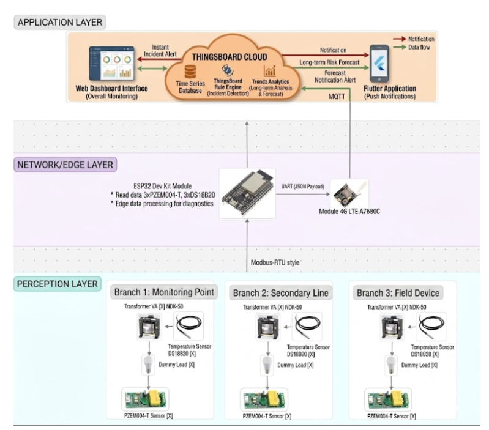
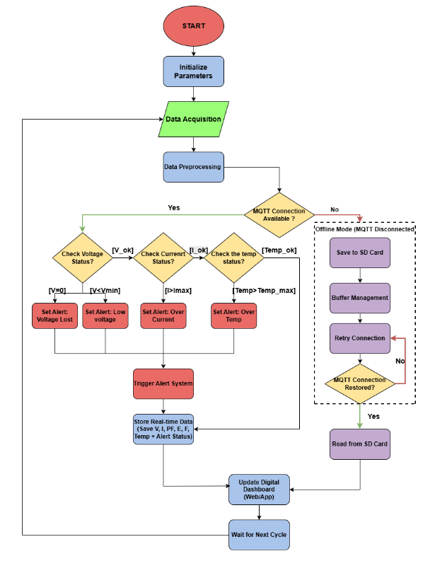
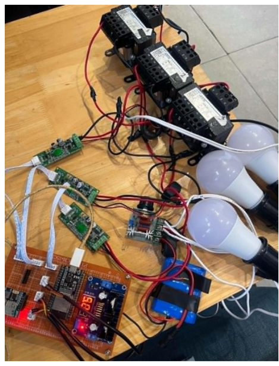
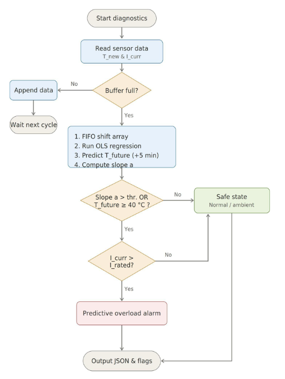
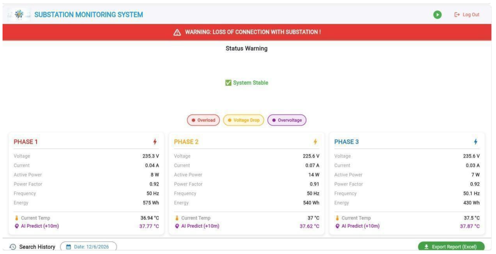
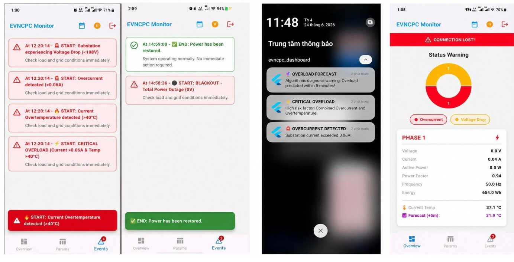

<div align="center">

# ⚡ Digital Transformer: IoT Real-Time Grid Monitoring & Predictive Maintenance

**A comprehensive, industrial-grade IoT ecosystem designed to modernize low-voltage distribution grids. Featuring multi-channel electrical telemetry, Edge-Computing-based thermal prediction, and a fault-tolerant Cloud-to-Mobile architecture.**

[](#)
[](#)
[](#)
[](#)
[](#)

*Capstone Project - Faculty of Advanced Science and Technology (FAST), Da Nang University of Science and Technology*

</div>

---

## 📖 1. Project Background & Motivation

In modern power grids, unexpected failures at the low-voltage distribution transformer level are a primary cause of widespread power outages. Traditional grid monitoring relies heavily on scheduled manual inspections, which inherently suffer from a **"Lagging Indicator"** problem—by the time a severe overload or overheating issue is detected, physical degradation to the transformer's insulation has already occurred.

This project introduces the **"Digital Transformer"** architecture. By retrofitting existing transformers with a sophisticated layer of sensors, edge processors, and 4G LTE cellular connectivity, this platform shifts grid management from a *Reactive Troubleshooting* paradigm to a proactive **Condition-Based Maintenance (CBM)** model.

---

## 🏗️ 2. Comprehensive System Architecture

To ensure industrial reliability, the platform is decoupled into a 4-layer IoT architecture, allowing for modular upgrades and distinct functional separation.

<p align="center">
  
  <br><em>The End-to-End Data Pipeline: From physical assets to end-user applications.</em>
</p>

### The Logical Workflow & Data Flow
Data integrity is maintained through a strict, multi-stage processing pipeline:

<p align="center">
  
</p>

1.  **Data Acquisition:** Continuous polling of electrical and thermal sensors via isolated communication buses.
2.  **Edge Preprocessing & Diagnostics:** The ESP32 scrubs erroneous data (e.g., NaN values caused by EMI) and computes future thermal states.
3.  **Network Routing:** Telemetry is packaged into highly optimized JSON payloads and dispatched via MQTT.
4.  **Cloud Rule Engine:** Server-side logic evaluates payloads against safety thresholds to trigger database logging or immediate Firebase Push Notifications.

---

## 🛠️ 3. Hardware Engineering & Component Selection

The physical layer was meticulously engineered to withstand the electromagnetically noisy environment of a power substation.

*   **Central Processing (DCU):** **ESP32 DevKit V1** (Dual-Core, 240MHz). Chosen for its robust RTOS capabilities, multiple UART/SPI buses, and adequate SRAM for running predictive regression mathematics locally.
*   **Electrical Sensing:** 3x **PZEM-004T V3.0** modules paired with 100A Split-Core Current Transformers (CTs). These communicate with the ESP32 via **Modbus RTU (RS-485)**. *Engineering Note: 120-ohm termination resistors were physically soldered to the Modbus daisy chain to eliminate signal reflection and EMI corruption.*
*   **Thermal Sensing:** 3x **DS18B20** digital sensors utilizing the **1-Wire** protocol for precise, phase-specific winding temperature monitoring.
*   **Cellular Telemetry:** The **SIM A7680C (4G LTE Cat-1)** module, communicating via AT Commands over UART. Chosen over 2G/3G modules to ensure long-term grid compatibility and lower latency.
*   **Galvanic Isolation:** The entire control circuitry is protected from the 220V AC mains using an **NDK-50 Isolation Transformer**, paired with LM2596 buck converters for stable 5V/3.3V DC distribution.

<p align="center">
  
  <br><em>The physical prototype demonstrating isolated sensor nodes and the main Edge Gateway.</em>
</p>

---

## 🧠 4. Core Innovation: Edge-Computing Predictive Diagnostics

The crown jewel of this system is the **Hybrid Electro-Thermal Diagnostic Algorithm** running locally on the ESP32. 

Relying solely on a static temperature threshold (e.g., alerting when Temp > 80°C) is flawed due to thermal inertia. By the time the oil heats up, the electrical overload has already been occurring for minutes. Conversely, a sudden temperature spike might just be a hot summer day, not an electrical fault.

### The Algorithm: Time-Series Linear Regression (OLS)
<p align="center">
  
</p>

1.  **Multi-Channel Sliding Buffer:** The system maintains three independent, 5-element FIFO buffers (representing a 50-second short-term memory) for each transformer phase. This prevents the "Masking Effect" where averaging temperatures across phases hides a single localized overheating event.
2.  **Ordinary Least Squares (OLS):** Once the buffer is full, the ESP32 applies OLS mathematics to calculate the rate of temperature change (Slope) and the intercept.
3.  **Future Extrapolation:** The firmware extrapolates the linear trend equation exactly **5 minutes (300 seconds) into the future**.
4.  **Hybrid Verification:** A critical `predictive_overload_flag` is only raised if two physical conditions are met simultaneously:
    *   Instantaneous Current exceeds the Rated Capacity.
    *   The 5-minute Predicted Temperature breaches the safety threshold (>= 40°C).

---

## 🛡️ 5. Industrial Resilience & Fault Tolerance

Grid monitoring systems must operate 24/7 without data loss. I implemented advanced software recovery mechanisms:

*   **Hardware Watchdog & Auto-Reconnect:** If the MQTT ping fails consecutively, the ESP32 forces a hardware-level reset of the A7680C module via a dedicated GPIO pin, forcing cellular re-registration.
*   **Offline Data Logging (Store-and-Forward):** During 4G network outages, the ESP32 switches to Offline Mode. Telemetry is timestamped via the SIM's cellular clock and written to an `offline.log` file on an **SPI MicroSD Card**.
*   **Backlog Synchronization:** Upon network restoration, the system reads the SD card and bulk-publishes the historical data using the `ThingsBoard Bulk Telemetry` format (array of JSONs), ensuring zero data loss on the cloud charts.

---

## ☁️ 6. Cloud Infrastructure & Rule Engine (ThingsBoard)

Data is securely transmitted to **ThingsBoard Cloud** using MQTT QoS 1 (At least once delivery). 

### The Telemetry Payload (JSON)
To minimize cellular bandwidth, data is concatenated into a highly optimized flat JSON structure: 
```json
{
  "voltage1": 220.5, "current1": 1.25, "activePower1": 275,
  "temp1": 35.50, "pred_t1": 38.20,
  "predict_overheat_1": false,
  "datetime": "26/06/14,11:30:00+28"
}
```

---

## 📱 7. UI/UX: Web Dashboard & Flutter Mobile App

The platform completely eliminates the latency of traditional HTTP Polling by establishing a **Full-Duplex WebSocket** connection between the cloud and the end-user interfaces.

<p align="center">
   &nbsp;
  
</p>

*   **Web Dashboard (Control Room):** Features a Drill-Down UI design with Analog Gauges (dynamically changing colors based on thresholds), Real-time Alarm Tables, and Historical Time-Series Line Charts capable of exporting data to CSV.
*   **Flutter Application (Field Technicians):** Developed using Dart with Provider/GetX for efficient state management. Incorporates the `firebase_messaging` package to deliver **Lock-Screen Push Notifications**. Tapping an alert deep-links the technician directly to the affected transformer phase for immediate assessment.

---

## 🧪 8. Experimental Validation

The system underwent rigorous laboratory testing, including 24-hour burn-in tests and simulated thermal shocks using heat guns.

| Testing Scenario | Technical Target | Actual Result | Evaluation |
| :--- | :--- | :--- | :--- |
| **Electrical Accuracy** | &lt; 5% Error | Voltage: 0.18%, Current: 2.33% | ✅ Excellent |
| **Thermal Accuracy** | &lt; 5% Error | 1.81% compared to reference probe | ✅ Excellent |
| **End-to-End Latency** | &lt; 10 seconds | **5 - 6 seconds** (Hardware to App UI) | ✅ Passed |
| **Packet Loss (QoS 1)** | &lt; 1% Loss | **0%** (Across 8,640 continuous payloads) | ✅ Passed |
| **Thermal Shock Test** | Predict &lt; 30s | Triggered alarm in **under 10 seconds** | ✅ Passed |

---

## 📂 9. Repository Structure

```text
📦 IoT-Digital-Transformer-Monitoring
 ┣ 📂 ESP32_Firmware                 # C/C++ Edge Computing, Modbus, MQTT, SD Card
 ┣ 📂 EVN_Web_App             # Dart source code for iOS/Android application
 ┣ 📂 images                         # Architecture diagrams, flowcharts, and prototype photos
 ┗ 📜 README.md
